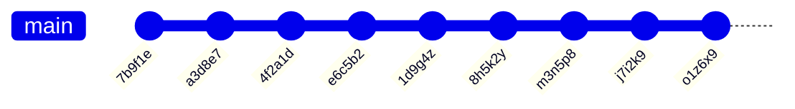

# Applied task: "Commit History"

This final course assignment repository contains various exercises designed to deepen and apply the topics from previous weeks. You have more freedom in solving these tasks, so you can approach them in many different ways.

We recommend considering whether creating separate classes, stream operations, or even a map data structure might help in solving different problems.

## Testing the tasks

This task package includes ready-made tests to ensure the functionality of your solutions. The ready-made tests ensure that the end result of your code is correct. Since the freedom in solving the tasks is greater than before, you will likely need various helper methods and classes. To ensure their functionality, we recommend writing your own tests as well. Alternatively, you can write your own main methods to examine the functionality of your code.

Familiarizing yourself with the tests is not necessary to complete the task, but running the tests is highly recommended to get feedback on the functionality of your solutions.

You can run the unit tests as usual with your code editor's testing tool or with the Gradle automation tool.

> [!NOTE]
> Changing the names, parameters, or return values of the methods and classes specified in the assignment is not allowed, but we **recommend** that you implement your own classes and methods in addition to them.
>
> You may write additional tests if you wish, but do not modify or delete the pre-written tests.

## Submitting the task

Submit the task using Git's `add`, `commit`, and `push` commands as you have done with previous tasks. You can submit your solution for evaluation as many times as needed until the task deadline. However, ensure that your latest submission yields the best scores, as only the most recent scores will be considered.

## Git change log

As you have learned in the course so far, Git keeps track of changes in the repository using commits. Each commit has an author, id, message, and a "parent" that always points to the previous commit. One way to represent the project's history in text form could be the following format:

```
Commit 7b9f1e by NewbieNate (Parent: None)
Initial Commit - Hello World!
Starting my coding journey. Decided to say "Hello" to the world!

Commit a3d8e7 by ProgPete (Parent: 7b9f1e)
Added comments - Explained 'Hello World'
Hey there, Nate! Added comments to your code, explaining what each line does. Welcome aboard!

Commit 4f2a1d by EagerElla (Parent: a3d8e7)
Added Function - Counting Sheep
Created a function to count sheep. Learning to make my code more functional, quite literally!

Commit e6c5b2 by LoopyLou (Parent: 4f2a1d)
Merge branch 'master' into loop-feature
Adding a loop to count sheep indefinitely. Sleepless nights led to sheep-filled code!

Commit 1d9g4z by NewbieNate (Parent: e6c5b2)
Fixed Loop Bug - Sheep now sleep
Oops! Fixed the loop. Turns out, the sheep were sleep-deprived. Now they can rest peacefully.

Commit 8h5k2y by EagerElla (Parent: 1d9g4z)
Refactor - Shepherd Class
Introduced a Shepherd class to manage the sheep better. Feeling like a digital shepherd now!

Commit m3n5p8 by ProgPete (Parent: 8h5k2y)
Documentation Update - Shepherd class explained
Documented the Shepherd class methods. Now we're herding sheep like pros!

Commit j7i2k9 by LoopyLou (Parent: m3n5p8)
Fix typo - Shepherd 'sheep' to 'sheep_count'
Typo fix! The shepherd should count the sheep_count, not the sheep itself. Phew!

Commit o1z6x9 by NewbieNate (Parent: j7i2k9)
Merge branch 'refactor' into master
Merging the refactor changes. Thanks for the help, team! Learning and growing together.
```

In this task, the data consists of multi-line strings that represent the change history of fictional projects in the format described above. A more extensive example can be found in a separate file [commit-log-example.txt](./commit-log-example.txt).

For example, a single commit by a user named `ohjelmointi2` with the id `d4e5f6` might look like this:

```java
"""
Commit d4e5f6 by ohjelmointi2 (Parent: a1b2c3)
This is my comment message!
The message is two lines long...
"""
```

Note that the "Parent" of the first commit is `"None"`. All other commit ids are presented in the task as six-character [alphanumeric](https://en.wikipedia.org/wiki/Alphanumericals) strings. The length of the "Commit message" can vary, it can include one or more lines, and it may contain any special characters, including emoji.

The version history of Git repositories is often also presented in graphical form, where the same commits could be represented, for example, as follows:



> [!IMPORTANT]
> Although this task uses Git history as an example, **you do not need to use any new Git commands**. All task logic is implemented using Java strings, methods, and classes.
> 
> Typically, in a larger project, there are multiple development branches simultaneously, making the history appear more complex. In this course, we will use only one main development branch, named `master` or `main`.

## Osa 0: ratkaisun suunnittelu *(valmistelut)*

Aikaisemmista tehtävärepositorioista poiketen tätä tehtävää ei kannata välttämättä tehdä yksi vaihe kerrallaan, vaan sinun kannattaa perehtyä etukäteen kokonaisuuteen ja suunnitella, miten toteutat uudelleenkäytettäviä ratkaisuja, jotka edesauttavat tehtävän kaikkien osien ratkaisemista.

Esimerkiksi uuden `Commit`-luokan luominen voi tuntua alussa "ylimääräiseltä työltä", mutta se voi olla pidemmän päälle kannattavaa. Voit myös jatkokehittää erilaisia apuluokkia tehtävää edistäessäsi oman harkintasi mukaan.

## Part 0: solution design *(preparation)*

Unlike previous task repositories, it might not be advisable to complete this task one step at a time. Instead, you should familiarize yourself with the entire task in advance and plan how to implement reusable solutions that will help solve all parts of the task.

For example, creating a new `Commit` class might seem like "extra work" at first, but it can be beneficial in the long run. You can also further develop various helper classes as you progress with the task, according to your own judgment.

## Part 1: commit ids *(applying, 20 %)*

The [`CommitIds`](./src/main/java/part01/CommitIds.java) class has a method named `getCommitIds`. This method takes a multi-line string as a parameter, which contains the Git log of the fictional project in the format described above.

Complete the class with a solution that processes the string and returns the ids of the commits present in it. You can find a more detailed description of the method's functionality in the method comments.

This part of the task is tested with the [`CommitIdsTest`](./src/test/java/part01/CommitIdsTest.java) test class, which you can run either with your code editor's testing tool or with Gradle:

```
./gradlew test --tests CommitIdsTest        # unix
.\gradlew.bat test --tests CommitIdsTest    # windows
```

## Part 2: Contributors and statistics *(advanced, 20 % + 20 %)*

The [`Contributors`](./src/main/java/part02/Contributors.java) class has methods named `getContributors` and `groupCommitIdsByContributors`. Like in the previous part, these methods also take a multi-line string as a parameter, which contains the Git log of the fictional project in the format described above.

Complete the class with solutions that fulfill the functionalities mentioned in the method comments.

This part of the task is tested with two separate test classes: [`GetContributorsTest`](./src/test/java/part02/GetContributorsTest.java) and [`GroupCommitIdsTest`](./src/test/java/part02/GroupCommitIdsTest.java). You can run the tests either with your code editor's testing tool or with Gradle:

```
# unix
./gradlew test --tests GetContributorsTest
./gradlew test --tests GroupCommitIdsTest

# windows
.\gradlew.bat test --tests GetContributorsTest
.\gradlew.bat test --tests GroupCommitIdsTest
```

## Osa 3: Logitiedoston lukeminen, järjestäminen ja tulostaminen *(edistynyt, 40 %)*

Tehtävän viimeisessä osassa käsiteltävänäsi on "commit log"-tiedosto [pizza-commits.txt](./pizza-commits.txt), jonka sisältämät **commitit ovat epäjärjestyksessä**. Lokitiedoston jokaisessa commitissa on tieto sitä edeltävästä "Parent"-commitista, joiden avulla sinun tulee tulostaa commitit kronologisessa järjestyksessä.

Ohjelmasi suorituksen tulee käynnistyä tehtäväpohjassa valmiina olevasta Java-luokasta [part03.Main](./src/main/java/part03/Main.java). `main`-metodin lisäksi saat toteuttaa haluamasi apumetodit ja -luokat vapaasti. Kannustamme kirjoittamaan myös omia testejä ohjelmasi eri osien toimivuuden varmistamiseksi.

Sinulla on vapaat kädet toteuttaa ohjelman sisäinen logiikka parhaaksi katsomallasi tavalla, kunhan se täyttää seuraavat toiminnallisuudet:

* Ohjelmasi ei saa kysyä käyttäjältä syötteitä eikä tulostaa tehtävänantoon kuulumattomia tekstejä.
* Ohjelmasi tulee lukea commit-historia tehtäväpohjan tiedostosta nimeltä [pizza-commits.txt](./pizza-commits.txt). Tiedoston sisältö noudattaa samaa formaattia kuin aikaisemmat tehtävät.
* Ohjelmasi tulee tulostaa tiedostosta luetut commitit järjestyksessä siten, että commit, jonka "Parent" on "None", esitetään ensimmäisenä. Seuraavien committien tulee aina seurata omaa "Parent"-committiaan.
* Et saa muokata annettua tekstitiedostoa, vaan ohjelmasi on toimittava alkuperäisellä tiedostolla.

Voit suorittaa main-luokan joko koodieditorisi käyttöliittymässä tai Gradlen avulla:

```
./gradlew run       # unix
.\gradlew.bat run   # windows
```

Tehtävä tarkastetaan [`PizzaCommitsTest`-yksikkötestiluokalla](./src/test/java/part03/PizzaCommitsTest.java), jonka voit suorittaa koodieditorillasi tai Gradlella:

```
./gradlew test --tests PizzaCommitsTest        # unix
.\gradlew.bat test --tests PizzaCommitsTest    # windows
```

> [!NOTE]
> Huomaa, että vaikka tehtävässä lajitellaan committeja, ei sitä välttämättä voi ratkaista ainakaan pelkän lajittelualgoritmin avulla. Tämä johtuu siitä, että kahta committia vertaillessa et voi tietää, kumpi tulee ensin, elleivät ne eivät ole toistensa "parent" ja "child". Sinun täytyy siis soveltaa jotain muuta menetelmää.
>
> Kaikki projektin tiedostot on tallennettu UTF-8 -merkistöllä, joten jos kohtaat ongelmia merkistöjen kanssa, varmista että sekä koodissa että editorissasi on oikea merkistö. Windows-käyttäjät voivat määritellä Eclipsen merkistökoodauksen [tämän kuvan mukaisesti](https://ohjelmointi2.github.io/img/eclipse-workspace-encoding.jpg).
>
> Tiedostojen lukemisessa sinua auttavat esimerkiksi Javan [File](https://docs.oracle.com/en/java/javase/21/docs/api/java.base/java/nio/file/Files.html)- ja [Path](https://docs.oracle.com/en/java/javase/21/docs/api/java.base/java/nio/file/Path.html)-luokat. Esimerkki näiden käyttämisestä löytyy valmiina `main`-metodin pohjasta.


## Lisenssi ja tekijät

Tämän tehtävän on kehittänyt Teemu Havulinna ja se on lisensoitu [Creative Commons BY-NC-SA -lisenssillä](https://creativecommons.org/licenses/by-nc-sa/4.0/).

Tehtävässä esiintyvät commit log -tiedostot on luotu käyttäen apuna ChatGPT 3.5:ttä.

Tehtävänannon sekä lähdekoodien toteutuksessa on hyödynnetty ChatGPT 3.5:ttä sekä GitHub copilot -tekoälyavustinta.
