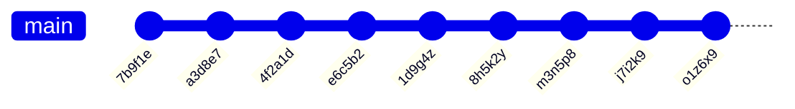

# Soveltavat tehtävät

Tämä kurssin viimeinen tehtävä sisältää erilaisia harjoitteita, joiden avulla syvennetään ja sovelletaan aikaisempien viikkojen aiheita. Tehtävien ratkaisemiseksi on annettu enemmän vapauksia, joten voit ratkaista tehtäviä monilla eri tavoilla. Suosittelemmekin pohtimaan, olisiko erillisten luokkien luominen, stream-operaatiot tai vaikka map-tietorakenne avuksi eri ongelmien ratkaisemisessa.

Tehtävien ratkaiseminen edellyttää tiedostojen käsittelyä. Kaikki projektin tiedostot on tallennettu UTF-8 -merkistöllä, joten jos kohtaat ongelmia merkistöjen kanssa, varmista että sekä koodissa että editorissasi on oikea merkistö. Esimerkiksi Windows-käyttäjät voivat määritellä Eclipsen merkistökoodauksen [tämän kuvan mukaisesti](https://ohjelmointi2.github.io/img/eclipse-workspace-encoding.jpg). Tiedostojen lukemisessa sinua auttavat esimerkiksi Javan [File](https://docs.oracle.com/en/java/javase/21/docs/api/java.base/java/nio/file/Files.html)- ja [Path](https://docs.oracle.com/en/java/javase/21/docs/api/java.base/java/nio/file/Path.html)-luokat. Ohjelmakoodissasi vastaavasti käytä aina merkistöjä, esim. `List<String> rivit = Files.readAllLines(tiedostonPolku, StandardCharsets.UTF_8);`.


## Tehtävien testaaminen


## Tehtävän palauttaminen

Palauta tehtävä Gitin `add`-, `commit`- ja `push`-komennoilla edellisten tehtävien tavoin. Voit lähettää ratkaisusi arvioitavaksi niin monta kertaa kuin on tarpeen tehtävän määräaikaan asti. Varmista kuitenkin, että viimeisin suoritus tuottaa parhaat pisteet, koska vain viimeisimmät pisteet jäävät voimaan.


## Osa 1: Git-statistiikka *()*

## Osa 2: Git-muutoslogi *()*

```
Commit 7b9f1e by NewbieNate (Parent: None)
Initial Commit - Hello World!
Starting my coding journey. Decided to say "Hello" to the world!

Commit a3d8e7 by ProgPete (Parent: 7b9f1e)
Added comments - Explained 'Hello World'
Hey there, Nate! Added comments to your code, explaining what each line does. Welcome aboard!

Commit 4f2a1d by EagerElla (Parent: a3d8e7)
Added Function - Counting Sheep
Created a function to count sheep. Learning to make my code more functional, quite literally!

Commit e6c5b2 by LoopyLou (Parent: 4f2a1d)
Merge branch 'master' into loop-feature
Adding a loop to count sheep indefinitely. Sleepless nights led to sheep-filled code!

Commit 1d9g4z by NewbieNate (Parent: e6c5b2)
Fixed Loop Bug - Sheep now sleep
Oops! Fixed the loop. Turns out, the sheep were sleep-deprived. Now they can rest peacefully.

Commit 8h5k2y by EagerElla (Parent: 1d9g4z)
Refactor - Shepherd Class
Introduced a Shepherd class to manage the sheep better. Feeling like a digital shepherd now!

Commit m3n5p8 by ProgPete (Parent: 8h5k2y)
Documentation Update - Shepherd class explained
Documented the Shepherd class methods. Now we're herding sheep like pros!

Commit j7i2k9 by LoopyLou (Parent: m3n5p8)
Fix typo - Shepherd 'sheep' to 'sheep_count'
Typo fix! The shepherd should count the sheep_count, not the sheep itself. Phew!

Commit o1z6x9 by NewbieNate (Parent: j7i2k9)
Merge branch 'refactor' into master
Merging the refactor changes. Thanks for the help, team! Learning and growing together.
```




## Osa 3: Muutoslogi rekursiolla *()*

## Osa 4: Rinnakkaisuus *()*


## Lisenssi ja tekijät

Tämän tehtävän on kehittänyt Teemu Havulinna ja se on lisensoitu [Creative Commons BY-NC-SA -lisenssillä](https://creativecommons.org/licenses/by-nc-sa/4.0/).

Tehtävänannon, käsiteltävien tiedostojen sekä lähdekoodien toteutuksessa on hyödynnetty ChatGPT 3.5:ttä sekä GitHub copilot -tekoälyavustinta.
