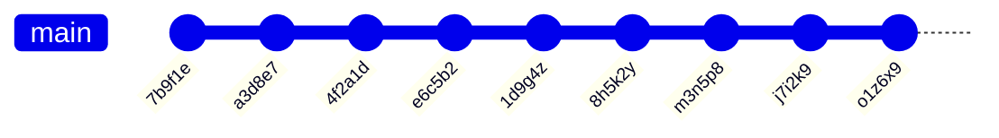

# Soveltava tehtävä: "Commit History"

Tämä kurssin viimeinen tehtävärepositorio sisältää erilaisia harjoitteita, joiden avulla syvennetään ja sovelletaan aikaisempien viikkojen aiheita. Tehtävien ratkaisemiseksi on annettu enemmän vapauksia, joten voitkin ratkaista ne monilla eri tavoilla.

Suosittelemmekin pohtimaan, olisiko erillisten luokkien luominen, stream-operaatiot tai vaikka map-tietorakenne avuksi eri ongelmien ratkaisemisessa.


## Tehtävien testaaminen

Tämä tehtäväpaketti sisältää valmiita testejä ratkaisujesi toimivuuden varmistamiseksi. Valmiit testit varmistavat, että koodisi lopputulos on oikea. Koska vapaudet tehtävän ratkaisujen suhteen ovat aiempaa vapaammat, tulet todennäköisesti tarvitsemaan erilaisia apumetodeja ja -luokkia, joiden toimivuuden varmistamiseksi suosittelemme kirjoittamaan lisäksi omia testejä. Vaihtoehtoisesti voit kirjoittaa omia main-metodeja, joiden avulla tutkit koodisi toimivuutta.

Testeihin perehtyminen ei ole tehtävän suorittamiseksi välttämätöntä, mutta testien suorittaminen on ehdottomasti suositeltua, jotta saat palautetta tekemiesi ratkaisujen toimivuudesta.

Voit suorittaa yksikkötestit tuttuun tapaan koodieditorisi testaustyökalulla tai Gradle-automaatiotyökalulla.

> [!NOTE]
> Tehtävänannossa määritettyjen metodien ja luokkien nimien, parametrien tai paluuarvojen muuttaminen ei ole sallittua, mutta **suosittelemme** että toteutat niiden lisäksi omia luokkia ja metodeita.
>
> Saat kirjoittaa halutessasi lisää testejä, mutta älä muuta tai poista valmiiksi kirjoitettuja testejä.


## Tehtävän palauttaminen

Palauta tehtävä Gitin `add`-, `commit`- ja `push`-komennoilla edellisten tehtävien tavoin. Voit lähettää ratkaisusi arvioitavaksi niin monta kertaa kuin on tarpeen tehtävän määräaikaan asti. Varmista kuitenkin, että viimeisin suoritus tuottaa parhaat pisteet, koska vain viimeisimmät pisteet jäävät voimaan.


## Gitin muutoslogi

Kuten olet kurssilla tähän mennessä oppinut, Git pitää kirjaa repositoriossa tapahtuvista muutoksista committien avulla. Kullakin commitilla on tekijä, id, viesti, sekä "parent", joka osoittaa aina edeltävään committiin. Yksi tapa esittää projektin historiaa tekstimuodossa voisikin olla seuraava esitystapa:

```
Commit 7b9f1e by NewbieNate (Parent: None)
Initial Commit - Hello World!
Starting my coding journey. Decided to say "Hello" to the world!

Commit a3d8e7 by ProgPete (Parent: 7b9f1e)
Added comments - Explained 'Hello World'
Hey there, Nate! Added comments to your code, explaining what each line does. Welcome aboard!

Commit 4f2a1d by EagerElla (Parent: a3d8e7)
Added Function - Counting Sheep
Created a function to count sheep. Learning to make my code more functional, quite literally!

Commit e6c5b2 by LoopyLou (Parent: 4f2a1d)
Merge branch 'master' into loop-feature
Adding a loop to count sheep indefinitely. Sleepless nights led to sheep-filled code!

Commit 1d9g4z by NewbieNate (Parent: e6c5b2)
Fixed Loop Bug - Sheep now sleep
Oops! Fixed the loop. Turns out, the sheep were sleep-deprived. Now they can rest peacefully.

Commit 8h5k2y by EagerElla (Parent: 1d9g4z)
Refactor - Shepherd Class
Introduced a Shepherd class to manage the sheep better. Feeling like a digital shepherd now!

Commit m3n5p8 by ProgPete (Parent: 8h5k2y)
Documentation Update - Shepherd class explained
Documented the Shepherd class methods. Now we're herding sheep like pros!

Commit j7i2k9 by LoopyLou (Parent: m3n5p8)
Fix typo - Shepherd 'sheep' to 'sheep_count'
Typo fix! The shepherd should count the sheep_count, not the sheep itself. Phew!

Commit o1z6x9 by NewbieNate (Parent: j7i2k9)
Merge branch 'refactor' into master
Merging the refactor changes. Thanks for the help, team! Learning and growing together.
```

Tässä tehtävässä käsiteltävä data koostuu monirivisistä merkkijonoista, jotka esittävät kuvitteellisten projektien muutoshistoriaa yllä esitetyssä muodossa. Laajempi esimerkki löytyy erillisestä tiedostosta [commit-log-example.txt](./commit-log-example.txt).

Esimerkiksi `ohjelmointi2`-nimisen käyttäjän yksittäinen commit, jonka id on `d4e5f6`, voisi näyttää seuraavalta:

```java
"""
Commit d4e5f6 by ohjelmointi2 (Parent: a1b2c3)
This is my comment message!
The message is two lines long...
"""
```

Huomaa, että ensimmäisen commitin "Parent" on `"None"`. Kaikki muut commit id:t on esitetty tehtävässä kuuden merkin pituisina [aakkosnumeerisinä](https://fi.wiktionary.org/wiki/aakkosnumeerinen) merkkijonoina. "Commit messagen" pituus voi vaihdella, siihen voi kuulua yksi tai useampia rivejä, ja siinä saattaa olla mitä tahansa erikoismerkkejä, mukaan lukien emoji-merkkejä.

Git-repositorioiden versiohistoriaa esitetään usein myös graafisessa muodossa, jossa samat commitit voitaisiin esittää esimerkiksi seuraavasti:



> [!IMPORTANT]
> Vaikka tässä tehtävässä esimerkkinä on Gitin historian käsitteleminen, **sinun ei tarvitse käyttää yhtään uusia Git-komentoja**. Kaikki tehtävän logiikka toteutetaan käyttäen Javan merkkijonoja, metodeja ja luokkia.
> 
> Tyypillisesti isommassa projektissa on samanaikaisesti useampia kehityshaaroja, jolloin historia näyttää myös monimutkaisemmalta. Tällä kurssilla käytämme ainoastaan yhtä pääkehityshaaraa, joka on nimeltään `master` tai `main`.


## Osa 0: ratkaisun suunnittelu *(valmistelut)*

Aikaisemmista tehtävärepositorioista poiketen tätä tehtävää ei kannata välttämättä tehdä yksi vaihe kerrallaan, vaan sinun kannattaa perehtyä etukäteen kokonaisuuteen ja suunnitella, miten toteutat uudelleenkäytettäviä ratkaisuja, jotka edesauttavat tehtävän kaikkien osien ratkaisemista.

Esimerkiksi uuden `Commit`-luokan luominen voi tuntua alussa "ylimääräiseltä työltä", mutta se voi olla pidemmän päälle kannattavaa. Voit myös jatkokehittää erilaisia apuluokkia tehtävää edistäessäsi oman harkintasi mukaan.


## Osa 1: Commit ids *(soveltava, 20 %)*

[`CommitIds`](./src/main/java/part01/CommitIds.java)-luokassa on metodi nimeltä `getCommitIds`. Tämä metodi saa parametrinaan monirivisen merkkijonon, joka sisältää edellä kuvitteellisen projektin Git-login ylempänä esitetyssä muodossa.

Täydennä luokkaan ratkaisu, joka käsittelee merkkijonoa ja palauttaa siinä esiintyvien committien id:t. Tarkemman kuvauksen metodin toiminnasta löydät metodin kommenteista.

Tehtävän tämä osa testataan [`CommitIdsTest`-testiluokalla](./src/test/java/part01/CommitIdsTest.java), jonka voit suorittaa joko koodieditorisi testaustyökalulla tai Gradlella:

```
./gradlew test --tests CommitIdsTest        # unix
.\gradlew.bat test --tests CommitIdsTest    # windows
```


## Osa 2: Contributors and statistics *(edistynyt, 20 % + 20 %)*

[`Contributors`](./src/main/java/part02/Contributors.java)-luokassa on metodit nimeltä `getContributors` sekä `groupCommitIdsByContributors`. Kuten edellisessä osassa, myös nämä metodit saavat parametrinaan monirivisen merkkijonon, joka sisältää edellä kuvitteellisen projektin Git-login ylempänä esitetyssä muodossa.

Täydennä luokkaan ratkaisut, jotka täyttävät näiden metodien kommenteissa mainitut toiminnallisuudet.

Tehtävän tämä osa testataan kahdella erillisellä testiluokalla: [`GetContributorsTest`](./src/test/java/part02/GetContributorsTest.java) ja [`GroupCommitIdsTest`](./src/test/java/part02/GroupCommitIdsTest.java). Voit suorittaa testit joko koodieditorisi testaustyökalulla tai Gradlella:

```
# unix
./gradlew test --tests GetContributorsTest
./gradlew test --tests GroupCommitIdsTest

# windows
.\gradlew.bat test --tests GetContributorsTest
.\gradlew.bat test --tests GroupCommitIdsTest
```


## Osa 3: Logitiedoston lukeminen, järjestäminen ja tulostaminen *(edistynyt, 40 %)*

Tehtävän viimeisessä osassa käsiteltävänäsi on "commit log"-tiedosto [pizza-commits.txt](./pizza-commits.txt), jonka sisältämät **commitit ovat epäjärjestyksessä**. Lokitiedoston jokaisessa commitissa on tieto sitä edeltävästä "Parent"-commitista, joiden avulla sinun tulee tulostaa commitit kronologisessa järjestyksessä.

Ohjelmasi suorituksen tulee käynnistyä tehtäväpohjassa valmiina olevasta Java-luokasta [part03.Main](./src/main/java/part03/Main.java). `main`-metodin lisäksi saat toteuttaa haluamasi apumetodit ja -luokat vapaasti. Kannustamme kirjoittamaan myös omia testejä ohjelmasi eri osien toimivuuden varmistamiseksi.

Sinulla on vapaat kädet toteuttaa ohjelman sisäinen logiikka parhaaksi katsomallasi tavalla, kunhan se täyttää seuraavat toiminnallisuudet:

* Ohjelmasi ei saa kysyä käyttäjältä syötteitä eikä tulostaa tehtävänantoon kuulumattomia tekstejä.
* Ohjelmasi tulee lukea commit-historia tehtäväpohjan tiedostosta nimeltä [pizza-commits.txt](./pizza-commits.txt). Tiedoston sisältö noudattaa samaa formaattia kuin aikaisemmat tehtävät.
* Ohjelmasi tulee tulostaa tiedostosta luetut commitit järjestyksessä siten, että commit, jonka "Parent" on "None", esitetään ensimmäisenä. Seuraavien committien tulee aina seurata omaa "Parent"-committiaan.
* Et saa muokata annettua tekstitiedostoa, vaan ohjelmasi on toimittava alkuperäisellä tiedostolla.

Voit suorittaa main-luokan joko koodieditorisi käyttöliittymässä tai Gradlen avulla:

```
./gradlew run       # unix
.\gradlew.bat run   # windows
```

Tehtävä tarkastetaan [`PizzaCommitsTest`-yksikkötestiluokalla](./src/test/java/part03/PizzaCommitsTest.java), jonka voit suorittaa koodieditorillasi tai Gradlella:

```
./gradlew test --tests PizzaCommitsTest        # unix
.\gradlew.bat test --tests PizzaCommitsTest    # windows
```

> [!NOTE]
> Huomaa, että vaikka tehtävässä lajitellaan committeja, ei sitä välttämättä voi ratkaista ainakaan pelkän lajittelualgoritmin avulla. Tämä johtuu siitä, että kahta committia vertaillessa et voi tietää, kumpi tulee ensin, elleivät ne eivät ole toistensa "parent" ja "child". Sinun täytyy siis soveltaa jotain muuta menetelmää.
>
> Kaikki projektin tiedostot on tallennettu UTF-8 -merkistöllä, joten jos kohtaat ongelmia merkistöjen kanssa, varmista että sekä koodissa että editorissasi on oikea merkistö. Windows-käyttäjät voivat määritellä Eclipsen merkistökoodauksen [tämän kuvan mukaisesti](https://ohjelmointi2.github.io/img/eclipse-workspace-encoding.jpg).
>
> Tiedostojen lukemisessa sinua auttavat esimerkiksi Javan [File](https://docs.oracle.com/en/java/javase/21/docs/api/java.base/java/nio/file/Files.html)- ja [Path](https://docs.oracle.com/en/java/javase/21/docs/api/java.base/java/nio/file/Path.html)-luokat. Esimerkki näiden käyttämisestä löytyy valmiina `main`-metodin pohjasta.


## Lisenssi ja tekijät

Tämän tehtävän on kehittänyt Teemu Havulinna ja se on lisensoitu [Creative Commons BY-NC-SA -lisenssillä](https://creativecommons.org/licenses/by-nc-sa/4.0/).

Tehtävässä esiintyvät commit log -tiedostot on luotu käyttäen apuna ChatGPT 3.5:ttä.

Tehtävänannon sekä lähdekoodien toteutuksessa on hyödynnetty ChatGPT 3.5:ttä sekä GitHub copilot -tekoälyavustinta.
